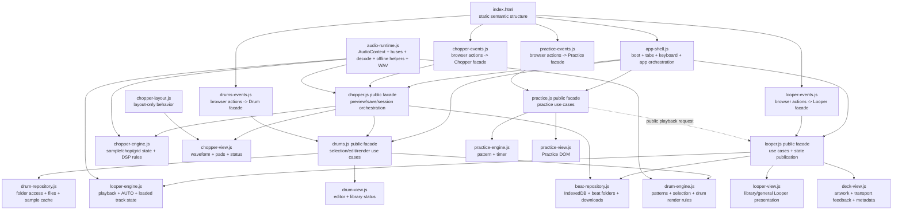

# Target architecture contract

This document freezes the intended architecture for the next version of Scratch Practice / Looper666.

It is derived from the current responsibility audit in `docs/RESPONSIBILITIES.md` and reviewed against the current V1 implementation. The goal is not to redesign the product from scratch. V1 remains the behavioral reference and source of proven algorithms, tests, assets, edge-case handling and compatibility knowledge.

The target is intentionally conservative: migrate working behavior behind clearer ownership boundaries, prove the pattern on one Looper vertical slice, and stop if the migration becomes a rewrite.

## Architecture goals

The target architecture must make these properties true:

1. Feature engines own musical/audio state and rules, not DOM.
2. Views own DOM/canvas rendering, not audio transport decisions.
3. Event adapters translate browser/user events into calls on one feature facade.
4. Feature facades/controllers own orchestration between engine, repository and view-facing state.
5. Persistence and filesystem access live behind repository/service boundaries.
6. Cross-feature work goes through public feature facades/services, never another feature's internals.
7. Shared runtime code stays neutral and never becomes a global application store.
8. V1 behavior is reused and migrated before any rewrite is considered.
9. No framework, bundler or language rewrite is required to obtain these boundaries.

## Important correction from the first target draft

The initial target allowed event adapters to call engines and repositories directly. That is too weak for the current product.

Current workflows already require orchestration across several concerns. For example, Chopper preview/save can involve Chopper state, Drum generation/rendering, OfflineAudio rendering and Beat repository persistence in one user action. If `chopper-events.js` coordinates all of that directly, it becomes the next god module.

Therefore each substantial feature gets one small public **facade/controller**. Event adapters call the facade. The facade coordinates same-feature engine/repository work and explicit cross-feature public services.

A facade is not a second engine and not a generic service container. It should stay thin and expose use cases rather than raw mutable state.

## Target module graph



Arrows mean permitted runtime knowledge/calls. A missing arrow is intentional.

## Target source layout

This is an ownership map, not a requirement to create every file immediately.

```text
js/
  app/
    bootstrap.js
    app-shell.js

  audio/
    audio-runtime.js

  beats/
    beat-repository.js

  looper/
    looper.js              # public facade
    looper-engine.js
    looper-view.js
    deck-view.js
    looper-events.js

  chopper/
    chopper.js             # public facade
    chopper-engine.js
    chopper-view.js
    chopper-layout.js
    chopper-events.js

  drums/
    drums.js               # public facade
    drum-engine.js
    drum-repository.js
    drum-view.js
    drums-events.js

  practice/
    practice.js            # public facade
    practice-engine.js
    practice-view.js
    practice-events.js
```

During migration it is preferable to have fewer well-owned files than to create the full directory tree with forwarding wrappers.

## Public facade rule

Other features and the app shell know a feature through its public facade only.

Examples:

```text
Looper.play()
Looper.stop()
Looper.selectRelative(delta)
Looper.setAutoSpeedLevel(level)
Looper.getState()
Looper.subscribe(listener)

Chopper.loadSample(file)
Chopper.preview()
Chopper.stop()
Chopper.saveCurrentBeat()
Chopper.getState()
Chopper.subscribe(listener)

Drums.generate(options)
Drums.clear()
Drums.render(...)
Drums.getState()
Drums.subscribe(listener)
```

The exact namespace mechanism can remain plain browser JavaScript. The important part is one intentional public surface per feature rather than unrelated globals.

Do not expose internal AudioNodes, timers, mutable arrays or repository handles through public state.

## State publication

The first draft made a global DOM `CustomEvent` the preferred state bus. That risks replacing global variables with a global event soup.

The preferred primary API is now:

```text
getState()
subscribe(listener) -> unsubscribe()
```

A feature facade publishes immutable/shallow-frozen snapshots to its subscribers. Views subscribe directly to their feature facade.

Named DOM events such as `sp:looper-state` may exist temporarily for V1 compatibility or browser-level integration, but they are not the primary V2 internal state mechanism and should disappear when no external consumer requires them.

## Shared runtime

### `audio-runtime`

Owns neutral browser-audio primitives:

- one live `AudioContext` lifecycle;
- master/live bus and connection helpers;
- audio decoding;
- OfflineAudioContext creation/helpers needed by current rendering workflows;
- WAV serialization;
- neutral audio/file safety limits where appropriate.

It does not own Looper, Chopper, Drum or Practice state and does not render feature UI.

Important: offline rendering is currently part of Chopper/Drum composition. The runtime must make this capability available without forcing repositories or views to know AudioContext internals.

### `app-shell`

Owns:

- boot sequencing;
- mode/tab switching;
- global keyboard shortcuts;
- boot diagnostics/error reporting integration;
- genuinely application-wide orchestration.

It calls feature facades, not event adapters and not feature engines.

`*-events.js` files are terminal browser adapters. Nothing calls them as services.

## Looper contract

Looper is the architecture pilot.

### Facade responsibility

The Looper facade owns use-case orchestration and state publication:

- load/select a track from repository results;
- play/stop/relative selection use cases;
- AUTO commands;
- public state snapshot/subscription;
- translating repository/engine results into view-facing feature state.

### Engine responsibility

`looper-engine` owns only playback state/rules:

- current loaded track playback payload;
- decoded deck buffer/source;
- play/stop behavior;
- playback rate;
- AUTO enabled state;
- AUTO loop count;
- AUTO speed policy/level;
- transport sequencing/race safety.

The engine does not list/search/delete beats and does not query or mutate DOM.

This separation avoids forcing `previous/next` ordering and repository knowledge into the audio engine.

### Minimum facade API for the pilot

```text
getState()
subscribe(listener)
play()
stop()
selectRelative(delta)
toggleAuto()
setAutoSpeedLevel(level)
```

Internal engine names may stay close to V1 initially. Callers must not depend on them.

### Looper state snapshot

A snapshot should contain only state needed by current callers/views, for example:

```text
{
  loaded,
  playing,
  trackId,
  trackName,
  bpm,
  speedPercent,
  autoEnabled,
  autoSpeedLevel,
  autoLoopCount,
  autoLoopBatch
}
```

Repository/library state may be a separate snapshot if it grows beyond a few fields. Do not create one giant feature state object merely for convenience.

### Views

`looper-view` owns general Looper/library presentation.

`deck-view` owns artwork preparation, transport feedback, cassette metadata, loop counter, loaded/playing visuals and deck hints.

Views render from public snapshots and public repository/facade results. They never read engine globals.

## Beat repository contract

`beat-repository` owns:

- IndexedDB beat rows;
- in-memory fallback;
- directory handle/permission handling;
- folder scan/cache;
- saving rendered beats;
- browser-download fallback;
- listing/deleting/importing beat records.

It returns data/results, not DOM state. It does not own playback or Chopper rendering.

User-gesture-sensitive filesystem operations are a hard constraint: permission/picker calls that currently require a direct click path must remain synchronously reachable from the event -> facade -> repository call chain before long async work. Architectural purity must not break browser activation semantics.

The existing V1 storage code should be migrated with minimal adaptation and parity tests.

## Chopper contract

### Facade

Chopper needs a facade because current use cases compose multiple subsystems.

It owns orchestration for:

- loading a sample;
- preview/re-preview;
- stop;
- save-current-beat;
- requesting a Drum selection/render through the public Drum facade;
- saving a rendered beat through Beat repository;
- publishing Chopper session state.

### Engine

Owns sample/chop/grid musical state, transient analysis, pitch/time conversion, conditioning/DSP decisions and render rules that are independent from DOM.

It must not draw canvas or handle pointer events.

### View

Owns waveform/marker/playhead canvas drawing, pads/grid rendering and status/readouts.

### Events

Own browser/file/pointer/control events only. Pointer coordinates may be normalized in the event/view boundary before calling engine/facade commands. Events must not become the orchestration layer.

## Drum contract

### Facade

Owns Drum use cases and state publication:

- generate/ensure selection;
- edit/clear selection;
- library connection workflows;
- render requests used by Chopper;
- view-facing status.

### Engine

Owns pattern catalog, selection/generation rules, edits/velocities/timing and pure drum render rules.

### Repository

Owns local drum directory handles, fallback file lists, compatible-file enumeration and sample-file/decode caching required by Drum rendering.

If decode caching needs AudioContext behavior, it may receive a neutral decode function from `audio-runtime`; it must not reach into Chopper/Looper runtime state.

### View

Owns editor rendering, selection status and library-loading presentation.

## Practice contract

The Practice facade owns start/stop/new-pattern use cases and public state publication.

`practice-engine` owns pattern generation and timer/step policy. `practice-view` owns notation/grid/count rendering.

Practice requests Looper playback through the public Looper facade. It never inspects Looper internals.

## Dependency rules

### Allowed

```text
app shell -> feature facades
feature events -> same-feature facade
feature facade -> same-feature engine/view/repository
feature facade -> explicitly allowed other feature facade/service
feature views <- same-feature snapshots/subscriptions
engines -> audio runtime
Chopper facade -> Drum facade
Chopper facade -> Beat repository
Practice facade -> Looper facade
```

### Forbidden

```text
app shell -> *-events.js
engine -> document / DOM rendering
view -> audio transport decisions
feature -> another feature's engine or internal globals
*-events.js -> direct orchestration across engines/repositories
*-events.js -> direct mutation of internal state
runtime monkey-patching of another module's function binding
hidden DOM nodes used as state buses
MutationObserver used to infer engine state when explicit state exists
repository -> feature UI
shared runtime -> feature-specific state
one global application event bus for ordinary feature state
one giant global application store
```

## Migration policy: reuse before rewrite

For every V1 capability, classify it before moving it:

- **reuse as-is** — independent data/algorithm already matches target ownership;
- **extract** — behavior is sound but mixed with DOM/storage/global reads;
- **adapt** — API shape changes while implementation remains mostly intact;
- **wrap temporarily** — V1 function remains behind a V2 facade during one migration step;
- **replace** — existing implementation itself causes the architectural problem;
- **delete** — obsolete compatibility/runtime residue.

A capability must not be rewritten simply because its code style is old.

Strong reuse candidates include drum pattern data, transient detection, WAV serialization, audio safety checks, filesystem edge-case handling, race-safety logic, deck geometry/assets and tested render algorithms.

## Anti-rewrite constraints

These rules exist specifically to prevent a V2 rewrite spiral:

1. Do not create empty target modules before a migrated behavior needs them.
2. Do not change architecture and user behavior in the same migration commit.
3. Do not redesign CSS/markup while extracting an engine boundary unless required for the boundary.
4. Do not replace working algorithms while moving them.
5. Do not migrate the next feature until the Looper pilot meets its gates.
6. If the pilot requires replacing more than roughly one third of its proven behavioral code rather than moving/adapting it, stop and review the target before continuing.
7. Temporary adapters must have one named removal condition and must not be duplicated.
8. V1 remains runnable until the V2 pilot has browser-level parity.

The one-third rule is a review trigger, not a metric to game. Its purpose is to detect an architecture that only works by throwing away proven code.

## Migration execution model

Do not build a parallel complete V2 skeleton first.

Use a strangler-style pilot inside a dedicated V2 branch:

### Gate 0 — inventory

Before code movement, produce an inventory of Looper capabilities/functions classified as reuse/extract/adapt/wrap/replace/delete, with the V1 tests that protect each important behavior.

No architectural code is written before this inventory exists.

### Gate 1 — facade around existing V1 behavior

Introduce the smallest Looper public facade around current behavior without moving algorithms yet.

Success means app-shell/deck callers can start moving away from globals while V1 internals still work.

### Gate 2 — explicit state boundary

Add `getState()/subscribe()` and move deck/app-shell reads to it. Remove the monkey-patch before or during this gate.

Success means UI no longer needs Looper engine globals.

### Gate 3 — engine extraction

Move only playback/AUTO/race-safety code behind `looper-engine`. Keep repository/library code where it is temporarily if needed.

Success means the engine has no DOM dependency and existing transport browser smoke remains green.

### Gate 4 — repository extraction

Move IndexedDB/filesystem/import/save behavior into Beat repository with preserved user-gesture semantics.

Success means Chopper can call Beat repository without importing/depending on Looper internals.

### Gate 5 — presentation extraction

Move remaining Looper/library DOM rendering into views.

Success means the old mixed Looper implementation has no unique behavior left. Only then delete the superseded V1 sections.

### Gate 6 — architecture decision

Measure the pilot qualitatively:

- fewer cross-file implicit dependencies;
- no increase in user-facing regressions;
- no explosion of forwarding wrappers;
- most V1 behavioral code moved/adapted rather than rewritten;
- tests are easier or equally easy to write;
- a new deck UI change would not touch playback code.

Only if these are true should Drums migration start.

## Test policy

V1 tests are part of the migration specification.

Before changing ownership of a behavior, keep or add a test that captures it. Preserve browser smoke for transport/audio/filesystem-visible workflows.

Add architecture checks only after a boundary exists. Do not make tests dictate a target filename before implementation proves that split useful.

Useful checks include:

- engine files contain no `document`/DOM selectors;
- deck/app-shell contain no Looper internal state names;
- event adapters do not call cross-feature engines/repositories directly;
- no monkey-patching assignments;
- public control IDs appear exactly once;
- repositories contain no feature-view selectors;
- facade public APIs and state snapshots remain available.

## Acceptance criteria for the Looper pilot

The target is considered proven, not merely documented, when:

- playback/AUTO behavior is migrated mostly by reuse/adaptation rather than rewrite;
- Looper engine has no DOM access;
- deck rendering has no direct Looper globals;
- app-shell keyboard uses the Looper facade;
- monkey-patching is gone;
- public state uses `getState()/subscribe()`;
- Beat repository is callable without Looper engine knowledge;
- filesystem permission flows still work under browser user-activation constraints;
- existing Looper browser smoke behavior passes;
- V1 remains available as behavioral reference until parity is established;
- no more than one temporary compatibility adapter remains at a time;
- changing deck presentation does not require changing playback internals.

At that point stop redesigning architecture. Use the proven pattern selectively for later migrations.

## Main known risks

### Over-separation

Too many files/facades can increase indirection more than they reduce coupling. Mitigation: create modules only when behavior moves; facades stay small and use-case-oriented.

### Orchestration sink

Without facades, `*-events.js` would accumulate repository/engine/cross-feature coordination. Mitigation: events call one facade.

### Event-bus replacement for globals

A global CustomEvent bus can become implicit shared state. Mitigation: direct `subscribe()` on feature facades is primary.

### Browser user-activation regressions

File/directory picker permissions can fail if architectural layers defer calls beyond the initiating gesture. Mitigation: repository permission acquisition remains directly reachable from the synchronous event call chain and is tested in Chromium.

### Audio runtime over-centralization

A shared audio module could become the new `core.js`. Mitigation: it exposes neutral primitives only; feature timing/musical state remains in feature engines.

### Chopper/Drum false separation

The product currently composes Chopper and Drum rendering. Pretending they are independent would force hidden coupling later. Mitigation: Chopper facade may explicitly depend on Drum facade for composition; engines remain isolated.

### Repository becoming a domain god-object

Beat repository serves Looper library and Chopper save but must not absorb track playback or UI policy. Mitigation: data/filesystem operations only, narrow result objects.

### Premature V2 deletion

Deleting V1 code too early removes the executable specification. Mitigation: delete only after a migrated vertical slice has parity tests/browser smoke and no unique callers.

## Non-goals

The V2 architecture does not require:

- a framework migration;
- TypeScript;
- bundlers;
- classes everywhere;
- dependency-injection infrastructure;
- a Redux-style store;
- a global event bus;
- recreating assets or CSS from scratch;
- rewriting proven DSP/audio algorithms for style;
- perfect separation of every feature before product development resumes.

The objective is lower coupling, explicit orchestration and preserved behavior — not architectural maximalism.
