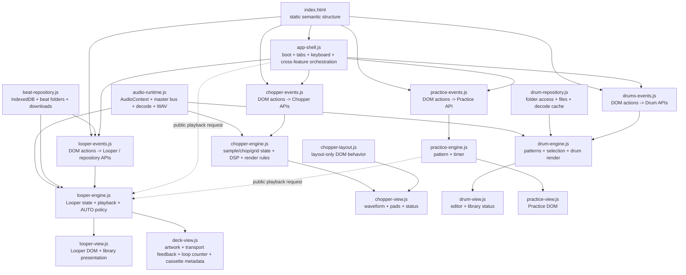

# Target architecture contract

This document freezes the intended architecture for the next version of Scratch Practice / Looper666.

It is derived from the current responsibility audit in `docs/RESPONSIBILITIES.md`. The goal is not to redesign the product from scratch. The current repository remains the behavioral reference, source of proven algorithms, tests, assets and compatibility knowledge. New code should migrate those pieces behind clearer ownership boundaries.

## Architecture goals

The target architecture must make these properties true:

1. Feature engines own state and audio behavior, not DOM.
2. Views own DOM/canvas rendering, not audio control.
3. Event adapters translate user actions into public feature APIs.
4. Persistence and filesystem access live behind repository/service boundaries.
5. Cross-feature calls use public APIs or named events, never another feature's internal globals.
6. Shared runtime code stays neutral and does not become a global application store.
7. The migration reuses validated V1 behavior instead of regenerating the product from scratch.
8. No framework or build-system rewrite is required to obtain these boundaries.

## Target module graph



Arrows mean permitted runtime knowledge/calls. A missing arrow is intentional.

## Target source layout

The exact filenames may evolve, but ownership must stay equivalent to this structure:

```text
js/
  app/
    bootstrap.js
    app-shell.js

  audio/
    audio-runtime.js

  beats/
    beat-repository.js

  looper/
    looper-engine.js
    looper-view.js
    deck-view.js
    looper-events.js

  chopper/
    chopper-engine.js
    chopper-view.js
    chopper-layout.js
    chopper-events.js

  drums/
    drum-engine.js
    drum-repository.js
    drum-view.js
    drums-events.js

  practice/
    practice-engine.js
    practice-view.js
    practice-events.js
```

This is an ownership map, not a mandate to create every file on day one. A migration may temporarily keep fewer files while preserving the same boundaries.

## Shared runtime

### `audio-runtime`

Owns only neutral browser-audio primitives:

- `AudioContext` lifecycle;
- master/live bus;
- audio decoding;
- connection helpers;
- WAV serialization;
- neutral audio/file limits where appropriate.

It must not own Looper, Chopper, Drum or Practice state. It must not render feature UI.

### `app-shell`

Owns:

- application boot sequencing;
- main mode/tab switching;
- global keyboard shortcuts;
- cross-feature orchestration that cannot belong to one feature;
- boot diagnostics/error reporting integration.

It may call feature public APIs. It must not inspect feature-internal variables such as `deckSource`, `sampleBuffer`, `currentDrumSelection` or `isLoopPlaying`.

## Looper contract

Looper is the first reference implementation for the target architecture.

### Engine responsibility

`looper-engine` owns:

- current track reference required for playback;
- decoded deck buffer/source;
- play/stop/previous/next behavior;
- playback rate;
- AUTO enabled state;
- AUTO loop count;
- AUTO speed policy/level;
- transport sequencing needed for race safety.

It does not query or mutate DOM.

### Minimum public API

The first migration should expose a small API equivalent to:

```text
getLooperState()
playDeck()
stopDeck()
selectRelative(delta)
toggleAutoLooper()
setAutoSpeedLevel(level)
```

Names may change during implementation, but callers must not need direct access to internal state.

### State snapshot

`getLooperState()` should return a read-only snapshot sufficient for all current Looper/deck rendering, for example:

```text
{
  loaded,
  playing,
  trackId,
  trackName,
  bpm,
  speedPercent,
  autoEnabled,
  autoSpeedLevel,
  autoLoopCount,
  autoLoopBatch
}
```

Do not expose `AudioBufferSourceNode`, timers, mutable internal arrays or raw internal objects unless a proven use case requires them.

### State notifications

One named state notification is preferred over hidden DOM bridges or observers of incidental text:

```text
sp:looper-state
```

The event tells views that a new snapshot is available. The snapshot remains the source of truth.

### Views

`looper-view` owns general Looper/library presentation.

`deck-view` owns:

- deck artwork preparation;
- transport backlights;
- cassette label/metadata;
- loop counter;
- loaded/playing visual state;
- deck hints.

Both render from Looper state snapshots and repository results. Neither reads Looper internal globals.

### Events

`looper-events` owns DOM actions:

- static transport button clicks;
- import buttons;
- drag/drop;
- search/sort controls.

It calls public Looper/repository functions. It does not mutate engine state directly.

## Beat repository contract

`beat-repository` owns storage and filesystem concerns shared by Looper and Chopper:

- IndexedDB beat rows;
- in-memory fallback;
- directory handle / permission handling;
- folder scan/cache;
- saving rendered beats;
- browser-download fallback;
- listing/deleting/importing beat records.

It does not own playback, AUTO state, cassette UI or Chopper rendering.

The existing V1 storage code should be migrated and adapted rather than rewritten without tests.

## Chopper contract

### Engine

Owns:

- sample state;
- marker/chop state;
- transient analysis;
- pitch/time conversion;
- conditioning/DSP decisions;
- loop-grid musical state;
- audition/render rules.

It must not own canvas drawing or pointer-event handling.

### View

Owns:

- waveform canvas;
- marker drawing;
- playhead drawing;
- pads/grid rendering;
- status/readout presentation.

### Events

Owns file inputs, controls, pointer actions and save orchestration. It calls Chopper/Drum/repository APIs rather than mutating shared globals.

## Drum contract

### Engine

Owns:

- pattern catalog and selection logic;
- generated/current drum selection;
- edits/velocities/timing state;
- drum render rules.

### Repository

Owns:

- local drum directory handles;
- fallback file lists;
- compatible-file enumeration;
- decoded-file cache.

### View

Owns editor rendering, selection status and library-loading presentation.

`drums-events` must not mutate `currentDrumSelection` or equivalent internal state directly.

## Practice contract

### Engine

Owns pattern generation, step/cycle progression and timer policy.

### View

Owns notation/grid/count rendering.

### Cross-feature playback

Practice may request Looper playback only through the public Looper API/app shell. It does not inspect `deckBuffer` or call internal transport state directly.

## Dependency rules

### Allowed

```text
app shell -> public feature APIs
feature events -> same-feature public API
feature views <- same-feature state snapshots/events
engines -> audio runtime
features -> repositories they explicitly depend on
Practice -> public Looper playback API
Chopper save -> beat repository
```

### Forbidden

```text
engine -> document / DOM rendering
view -> AudioContext transport control
feature -> another feature's internal globals
*-events.js -> direct mutation of internal state objects
a runtime file replacing another file's function binding
hidden DOM nodes used as state buses
MutationObserver used to infer engine state when an explicit state API exists
repository -> feature UI
core/shared runtime -> feature-specific global state
```

## Migration policy: reuse before rewrite

For each V1 capability, classify code as one of:

- **copy with minimal adaptation** — algorithm is already sound and independent;
- **extract** — behavior is sound but mixed with DOM/storage concerns;
- **wrap temporarily** — legacy function is needed while callers migrate;
- **replace** — only when the existing implementation is demonstrably the source of the architectural problem;
- **delete** — obsolete compatibility/runtime residue.

A migration must prefer validated existing behavior over a clean-room rewrite.

Good candidates to reuse largely intact include audio algorithms, drum pattern data, transient detection, WAV serialization, filesystem safety checks, deck geometry/assets and proven race-safety logic.

## Test policy

V1 tests are part of the migration specification.

Before replacing a behavior, keep or add a test that captures it. The target version should preserve useful existing tests and add architectural checks where boundaries become explicit.

Useful architecture checks include:

- no `document` usage in engine modules;
- no Looper internal state names in deck/app-shell modules;
- no monkey-patching assignments to imported/public functions;
- static public control IDs appear exactly once;
- repositories contain no feature-view selectors;
- expected named state events/APIs remain present.

Browser smoke tests remain required for user-visible transport/audio workflows.

## Migration order

1. Build the V2 skeleton around `audio-runtime`, `app-shell` and Looper boundaries.
2. Migrate one complete Looper vertical slice: transport -> engine -> state snapshot/event -> deck view.
3. Migrate the beat repository and Looper library presentation.
4. Validate behavioral parity with V1 tests and browser smoke tests.
5. Only if the Looper slice is demonstrably simpler, continue with Drums.
6. Migrate Chopper after the engine/view/repository pattern has been proven twice.
7. Migrate Practice last.

## Acceptance criteria for the architecture

The architecture is considered established when the Looper vertical slice proves all of the following:

- Looper playback works without engine DOM access;
- deck rendering works without direct Looper globals;
- no Looper monkey-patching remains;
- state is available through one explicit snapshot boundary;
- beat persistence can be called without going through the Looper engine;
- app-shell keyboard control uses public feature APIs;
- existing Looper browser smoke behavior still passes;
- adding or replacing deck UI does not require changing playback internals.

At that point, stop redesigning the architecture and use the established pattern for later migrations.

## Non-goals

The V2 architecture does **not** require:

- a framework migration;
- TypeScript;
- bundlers;
- classes everywhere;
- dependency injection infrastructure;
- a Redux-style global store;
- recreating assets or CSS from scratch;
- rewriting proven DSP/audio algorithms merely for style;
- perfect separation of every feature before product development resumes.

The goal is lower coupling and clear ownership, not maximum abstraction.
