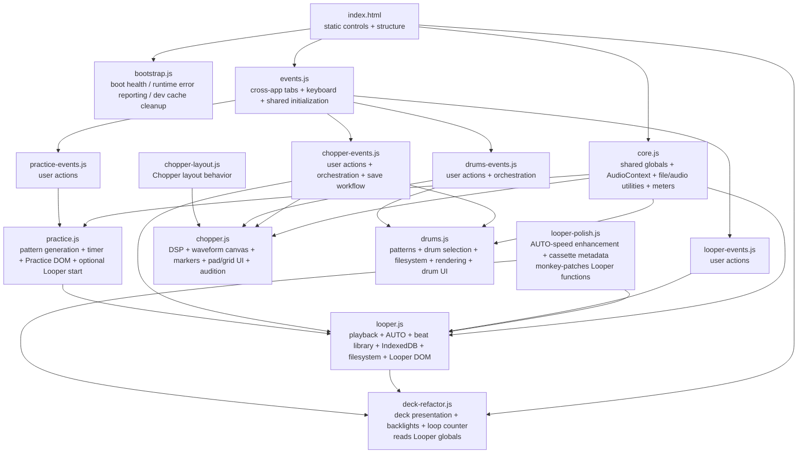
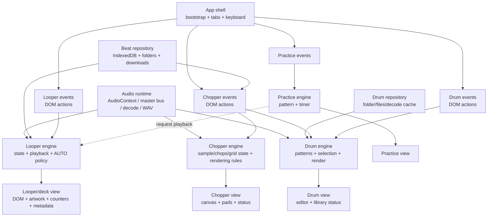

# Responsibility audit

This document records the current runtime responsibilities before the next engine/UI refactor.

## Current responsibility graph

Arrows mean runtime knowledge/calls, not script-load order.

## Responsibility audit by file

| File | What it actually owns today | Assessment | Desired responsibility |
|---|---|---|---|
| `bootstrap.js` | boot state, runtime error reporting, development SW/cache cleanup | Good boundary | Keep as application bootstrap/diagnostics only |
| `core.js` | global state for all features, AudioContext/live bus, file limits, decode/WAV helpers, transient detection, meters and meter DOM | Too broad | Shared audio/runtime primitives and neutral utilities; feature state should move to feature modules, meter presentation should move to UI |
| `events.js` | main tab switching, master-volume binding, Space shortcut, shared initialization | Mostly good, but knows feature internals | App-shell wiring only; invoke feature public APIs rather than globals/functions |
| `looper.js` | Looper audio state/playback/AUTO plus IndexedDB library, File System Access, downloads, library rendering and cassette DOM refresh | Main responsibility hotspot | Looper engine/state API only. Extract beat repository/storage and Looper presentation |
| `looper-events.js` | imports, drag/drop, transport clicks, library controls | Good direction | DOM actions -> public Looper/library APIs only; avoid touching engine globals |
| `deck-refactor.js` | deck artwork, overlays/backlights, loop counter, visual observers | Presentation role is good, data access is not | Pure deck view subscribing to explicit Looper state events/snapshots; no direct engine globals |
| `looper-polish.js` | cassette printed metadata and configurable AUTO speed; replaces `applyAutoLooperIncrement` and `refreshCassetteUI` at runtime | Highest-risk compatibility technique remaining | Remove monkey-patching. Fold AUTO-speed policy into Looper engine/API and printed-label rendering into deck view |
| `chopper.js` | sample DSP, pitch/time transforms, conditioning, waveform drawing, marker state, pointer interaction, pads/grid rendering and audition | Too broad | Split Chopper engine/state from Chopper view/canvas |
| `chopper-events.js` | sample import, controls, preview orchestration and beat-save filesystem workflow | Mixed | Keep user-action orchestration; move save/repository behavior behind services and state mutations behind Chopper API |
| `chopper-layout.js` | Chopper DOM/layout behavior | Acceptable UI module | Keep layout-only, with no engine state ownership |
| `drums.js` | pattern data/generation, drum state, folder access, decoding/rendering and drum editor/CTA DOM | Too broad | Drum engine/state + audio rendering separate from drum repository/filesystem and drum view |
| `drums-events.js` | drum user actions and preview orchestration | Good direction | DOM actions -> Drum/Chopper APIs; stop editing `currentDrumSelection` directly |
| `practice.js` | practice pattern/timer state, Practice rendering, tempo DOM reads and direct `playDeck()` integration | Small but coupled | Practice engine/timer + explicit view; request Looper playback through app/service boundary |
| `practice-events.js` | overlay/new/start bindings | Good boundary | Keep as DOM adapter |

## Main coupling leaks

### 1. Shared global state

`core.js` is effectively the global store for Looper, Chopper and Drums. Feature modules communicate by reading and mutating globals such as `deckBuffer`, `deckSource`, `sampleBuffer`, `renderedFlip`, `currentDrumSelection`, `isLoopPlaying` and AUTO state.

This is the largest architectural constraint on future UI work because ownership cannot be inferred from the variable itself.

### 2. Engine -> DOM

`looper.js`, `chopper.js`, `drums.js` and `practice.js` all render or query UI directly. This prevents their behavior from being tested independently from the current markup.

### 3. UI -> engine internals

`deck-refactor.js` reads Looper globals directly. `drums-events.js` mutates `currentDrumSelection` directly. Shared keyboard handling in `events.js` reads `deckSource` and `isLoopPlaying` directly.

### 4. Monkey-patching

`looper-polish.js` replaces `applyAutoLooperIncrement` and `refreshCassetteUI` after load. This is now the most fragile Looper dependency: correctness depends on load order and mutable global function bindings.

### 5. Filesystem/storage mixed with feature engines

Looper IndexedDB/File System Access lives in `looper.js`; drum folder access lives in `drums.js`; Chopper save orchestration reaches Looper beat-folder functions. Storage is therefore a cross-feature dependency disguised as engine functionality.

## Target responsibility graph

This is the direction to refactor toward. It is deliberately small; no framework or module-system rewrite is required first.

## Recommended migration order

1. **Remove `looper-polish.js` monkey-patching first.** Put AUTO-speed level/policy behind explicit Looper functions; move printed cassette metadata into the deck view.
2. **Introduce one read-only Looper state boundary.** A small `getLooperState()` plus `sp:looper-state` event is enough initially. Convert `deck-refactor.js` and the Space shortcut to it.
3. **Extract Looper presentation from `looper.js`.** Move `refreshCassetteUI` and library DOM rendering out without changing storage/audio behavior.
4. **Extract beat repository/storage.** IndexedDB and filesystem/download functions become a neutral service used by Looper and Chopper save.
5. **Repeat the pattern for Drums, then Chopper.** Drums has the next clearest split; Chopper is the most intertwined and should be tackled after the pattern is proven.
6. **Practice last.** It is small; replacing its direct `playDeck()` call is easy once the Looper API exists.

## Architectural rules for the next phase

- An `*-events.js` file may read DOM and call feature APIs, but should not mutate feature state objects/globals directly.
- An engine may own audio/state, but should not query or render DOM.
- A view may render DOM/canvas and subscribe to state, but should not start/stop audio directly.
- Storage/filesystem belongs behind repository/service functions, not inside presentation or event modules.
- Cross-feature calls go through a named public API/event, not through another feature's globals.
- Do not introduce a framework merely to enforce these boundaries; plain browser JavaScript is sufficient.
